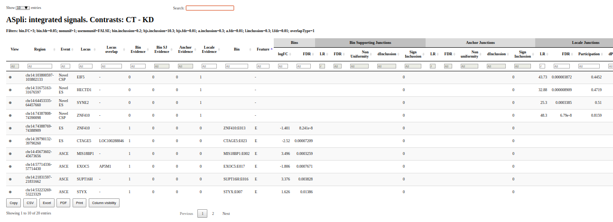

<!---
- Compile from command-line
Rscript -e "rmarkdown::render('sample.Rmd', c('html_document'), clean=FALSE)"
-->


# Introduction and quick start
Alternative splicing (AS) is a common mechanism of post-transcriptional gene 
regulation in eukaryotic organisms that expands the functional and regulatory 
diversity of a single gene by generating multiple mRNA isoforms that encode 
structurally and functionally distinct proteins. The development of novel 
high-throughput sequencing methods for RNA (RNAseq) has provided a powerful 
means of studying AS under multiple conditions and in a genome-wide manner 
\cite{pmid24549677}. However, using RNAseq to study changes in AS under 
different experimental conditions is not trivial. 
In this vignette, we describe how to use ASpli, an integrative and user-friendly
R package that facilitates the analysis of changes in both annotated and novel 
AS events. This package combines statistical information from exon, intron, and 
splice junction differential usage (p-value, FDR), with information from splice 
junction reads to calculate differences in the percentage of exon inclusion 
($\Delta$PSI) and intron retention ($\Delta$PIR). The proposed methodology 
reliably reflect the magnitude of changes in the relative abundance of different 
annotated and novel AS events. This method can be used to analyze both simple 
and complex experimental designs involving multiple experimental conditions.
# Getting started
## Installation
ASpli is available at Bioconductor site and can be downloaded using *biocLite()*:

```{r installation, eval=FALSE}
if (!requireNamespace("BiocManager", quietly = TRUE))
    install.packages("BiocManager")
BiocManager::install("ASpli")
library(ASpli)

```

## Required data

*ASpli* requires the *BAM* and *BAI* files for each sample in the experiment and the genome annotation in the format of TxDb. Please, **make sure all files use the same coordinate system**.

## Building a *TxDb* of your genome
Genome annotation should be providad as a *TxDb* object. 
The *GenomicFeatures* package provides functions to create TxDb objects based on data downloaded from
UCSC Genome Bioinformatics, BioMart or gff/gtf files. 
See "Creating New TxDb Objects or Packages" in the *GenomicFeatures* vignette for more details. In this example, a TxDb is built from a gtf file:

```{r txdb, eval=FALSE}
library(GenomicFeatures)
TxDb <- makeTxDbFromGFF(
  file="genes.gtf",
  format="gtf")
```


The building of a *TxDb* object might be time consuming, depending on the size of your genome.
If a *TxDb* has been already created, we strongly recommend saving it as a *sqlite* file
and reloading it any time the analysis is run. 


## A simple case
Here is an example, using default parameters for a pairwise comparison between 2 conditions: Control and treatment, 3 replicates each:
```{r quickStart,  eval=FALSE}
genome <- loadDb("txdb.sqlite")
BAMs <- NULL
features    <- binGenome(genome)
targets <- data.frame(
  BAM = c("CT_1.BAM", "CT_2.BAM","CT_3.BAM",
            "TR_1.BAM", "TR_2.BAM", "TR_3.BAM"),
  genotype = c( "CT", "CT", "CT",  "TR", "TR", "TR" ),
  stringsAsFactors = FALSE )
counts      <-  gbCounts(features = features, 
                         BAM = BAMs, 
                         targets = targets, 
                         minReadLength = 125L, 
                         maxISize = 50000)
asd         <-  jCounts(counts = counts, 
                        features = features,
                        BAM= BAMs, 
                        minReadLength =125L)
mBAMs <- data.frame(
  BAM=c("CT.BAM", "TR.BAM"),
  condition=c("CT","TR"))
contrasts  <- list(A_B = c(-1, 1))
gb      <- gbDUreport(counts, contrast = c(-1, 1))
jdur    <- jDUreport(asd, contrast =  c(-1, 1),
                     runUniformityTest = TRUE,
                     mergedBAMs = mBAMs,
                     strongFilter=TRUE)
sr      <- splicingReport(gb, jdur, counts)
is      <- integrateSignals(sr,asd)
reports <- list(gb=gb,j=jdur,sr=sr,is=is)
```

## Using *ASpli*
The workflow intended to be used with *ASpli* is divided in four main steps (Figure \ref{fig:ASpliStructure}). 
1. Extract features from genome TxDb: *binGenome()*
2. Counting:  *gbCounts()*,  *jCounts()*
3. Differential signals: *gbDUreport()*, *jDUreport()*
4. Reports: *splicingReport*, *integrateSignals()*
The main objects classes used to store data and perform operations are:
* *ASpliFeatures*: Contains genomic coordinates
* *ASpliCounts*: Contains number of reads overlapping each genomic feature
* *ASpliAS*: Contains counts of aligned junctions   
* *ASpliDU*: Contains results of Differential expression and usage
* *ASpliJDU*: Contains results of Differential Junctions usage
* *ASpliSplicingReport*: Contains differential usage information using different evidences
* *ASpliIntegratedSignals*: Contains signals present in the region
  
At each step it is possible to export intermediate results. 
See Section \ref{sec:outputs}:\nameref{sec:outputs} for more details.


## Splicing event assignation \label{sec:eventAssign}

Sub-genic features such as exons and introns are analyzed using the annotation by splitting the genome into non-overlapping features called bins, 
following the methodology proposed for DEXSeq \cite{pmid22722343}. Exon and intron 
coordinates are then extracted from the annotation, but only those from multi-exonic genes are saved for further evaluation. When more than one isoform exists, some exons and introns will overlap. Exons and introns are then subdivided into new features called exon and intron bins, and are then 
classified into {\em exclusively exonic bins}, {\em exclusively intronic bins}, or 
{\em alternative splicing bins} (AS) (See Figure \ref{fig:binDefinition}). 


\label{fig:binDefinition}

Each AS bin is assigned to a type of splicing event. The assignation is
made using *minimum  local gene models* considering unique patterns of three bins: the bin being evaluated and 
the two neighbor bins (one to the left, one to 
the right). Figure (\ref{fig:binAssignation}) shows examples of  splicing event categorization for different 
*minimum local gene models*. When the minimum local gene model contains two isoforms (see first row of figure \ref{fig:binAssignation}) bins are labelled as follow:

* **ES** Exon skipping
* **IR** Intron retention
* **ALt5'SS** Alternative 5' splicing site
* **ALt3'SS** Alternative 3' splicing site

When the minimum gene model contains three, four or five isoforms (no more than five non redundant isoforms can exist in the minimum gene model), labels of bins are similar to the ones defined previously but have an extra '*'
character ( **IR**, **ES**, **Alt5'SS**, **Alt3'SS**) in order to show that more than two isoforms exist and, therefore, the results should be used with caution (see rows 2-4 of figure \ref{fig:binAssignation}). 
This type of splicing events involve intronic subgenic regions sourrounded by exons in at least one isoform (**IR**), and exonic subgenic regions sourrounded by two introns in at least one isoform (**ES**). Minimum local gene models that do not fit in those categories are typified as **Alt5'SS** or **Alt3'SS** if they present exonic regions sourrounded by intronic and exonic neighbor subgenic regions.

In some cases, it is not possible to make a simple assignation for a bin with assumptions made here, those bins are labelled as **Undefined AS** (last row of figure \ref{fig:binAssignation}).

Those bins that overlap with the beginning or end of any transcript are labelled as **external**. Please note that an external bin of a transcript may overlap to a non external bin of another transcript, in these cases the bin is still labelled as **external**. In addition to these non overlapping bins, full introns are extracted from annotation and labelled as **Io** )


\label{fig:binAssignation}

#### *binGenome()* \label{sectionBinG}

The *binGenome* method is a one-stop function to perform:

* subgenic splitting of genes into bins
* junction, gene and bin coordinates definition
* bin splicing event assignation

Subgenic features are labelled as follow. For an hypothetical gene named GeneAAA:

* **GeneAAA:E001**: defines first exonic bin
* **GeneAAA:I001**: defines first intronic bin
* **GeneAAA:Io001**: defines first *italic* {Intron original}
* **GeneAAA:J001**: defines first annotated junction of GeneAAA
* **chr.start.end**: defines an experimental junction

Bins and junctions are consecutively named from 5' to 3' of reference sequence. This implies that lower numbers are always closer to the 5' of forward strand. Alternative splicing bins are named as exons.

*binGenome*'s output is an object of class *ASpliFeatures*. 
Methods *featuresg*, *featuresb*, *featuresj* can be used to access genes, bins and junctions coordinates as *GRanges* (*GRanges* objects defined in the *GenomicRanges* package.) 

```{r binGenome,  eval=FALSE}
annFile       <- aspliExampleGTF()
aTxDb         <- makeTxDbFromGFF(annFile)
features      <- binGenome( aTxDb ) 
geneCoord     <- featuresg( features )
binCoord      <- featuresb( features )
junctionCoord <- featuresj( features )
```
If symbols are available, they should be append as follow:

```{r binGenome2,  eval=FALSE}
symbols       <- data.frame( row.names = genes( aTxDb ), 
                             symbol = paste( 'This is symbol of gene:',
                                             genes( aTxDb ) ) )
features      <- binGenome( aTxDb, geneSymbols = symbols ) 
```

### Target definition \label{sec:targetsDef}

Sample names, genomic alignment file names and experimental factors should be specified in a dataframe that has as many rows as samples. Each row should be named with the corresponding sample name. The first column (*bam*) contains the path to a BAM file. Next columns should be used to specify the different experimental factors for each sample. For a 1 factor experiment with 2 conditions (Control and Treatment) and 2 replicates for each condition, **targets** dataframe could be defined as follow:

```{r targetsDF,  eval=TRUE}
BAMFiles = c("CT_1.BAM", "CT_2.BAM","CT_3.BAM",
            "TR_1.BAM", "TR_2.BAM", "TR_3.BAM")
targets <- data.frame(
  bam = c("CT_1.BAM", "CT_2.BAM","CT_3.BAM",
            "TR_1.BAM", "TR_2.BAM", "TR_3.BAM"),
  genotype = c( "CT", "CT", "CT",  "TR", "TR", "TR" ),
  stringsAsFactors = FALSE )
``` 

Complex designs, for example a 2 factor experiment (e.g. genotype and time), 2 values for each factor and 2 replicates for each condition, the **targets** can be defined like this:

```{r targetsDF2,  eval=TRUE}
BAMFiles <- c("CT_time1_rep1.BAM", "CT_time1_rep2.BAM",
              "CT_time2_rep1.BAM", "CT_time2_rep2.BAM",
              "TR_time1_rep1.BAM", "TR_time1_rep2.BAM",
              "TR_time2_rep1.BAM", "TR_time2_rep2.BAM")
targets_2 <- data.frame( row.names = c( 'CT_t1_r1',  'CT_t1_r2',
                                        'CT_t2_r1',  'CT_t2_r2',
                                        'TR_t1_r1', 'TR_t1_r2',
                                        'TR_t2_r1', 'TR_t2_r2' ),
                         bam = BAMFiles,
                         genotype = c( 'CT', 'CT', 'CT',  'CT', 
                                       'TR', 'TR', 'TR', 'TR' ),
                         time     = c( 't1', 't1', 't2', 't2', 
                                       't1', 't1', 't2', 't2' ),
                         stringsAsFactors = FALSE )
```

The name of the each experimental condition is determined from the experimental factors levels defined in the **targets** dataframe. They can be check using the *getConditions()* function. 

```{r targetsDF2b,  eval=FALSE}
getConditions( targets_2 )
```

## Read counting \label{sec:rcounts}

### *gbCounts*: Summarize read overlaps against all feature levels

The method  *gbCounts()* allows to count the number of reads that overlaps each defined feature (i.e. genes, bins, junctions and intron/exon flanking regions). For genes and bins, read density values are also computed as the ratio between the number of reads and the length of a given feature. 

```{r gbCounts,  eval=FALSE}
counts      <-  gbCounts(features, 
                         BAM, 
                         targets, 
                         minReadLength,
                         maxISize,
                         cores)
```

* *features*: An object of class *ASpliFeatures*. It is a list of GRanges at gene, bin and junction level
* *BAM*: List of GAlignments objects corresponding to BAM files of samples. If NULL is passed (default), BAM files are read and processed sequentially. This is usually preferred if machine has low resources.**bold{(hay alguna alternatvia a esto?)}
* *targets*: A dataframe containing sample, BAM and experimental factors columns, as defined in section \secref{sec:targetsDef}. 
* *minReadLength*: Read length of sequenced library. It is used for computing E1I and IE2 read summarization. If you have different read length, use the smallest, otherwise no E1I or IE2 will be found.
* *maxISize*: Maximum intron expected size. Junctions longer than *maxISize* will be dicarded  \cite{Hong01122006}.
* *cores*: Number of cores to use (Default=1). If *BAM* = NULL, only 1 core will be used independently of this parameter.
* *minAnchor*: Minimum percentage of read that should be aligned to an exon-intron boundary (see \secref{sec:intronFlanking} ). 

The result of *gbCounts()* method is an object of class 
*ASpliCounts* \label{sec:countsContents}. Count and read density dataframes could be extracted using accesors methods. See (\ref{sec:outputs}) section for more details.

Access data:
```{r gbCountAccessors,  eval=FALSE}
GeneCounts <- countsg(counts)
GeneRd <- rdsg(counts)
BinCounts <- countsb(counts)
BinRd <- rdsb(counts)
JunctionCounts <- countsj(counts)
```

Export tables to text files:
```{r gbCountsWrite,  eval=FALSE}
writeCounts(counts=counts, output.dir = "example")
writeRds(counts=counts, output.dir = "example")
```

### Additional considerations \label{sec:intronFlanking}

* Every intron is considered as a potential retained intron.  To analyze putative inton retention events, *ASpli* considers the  corresponding upstream and downstream exons (E1 and E2, always in the forward sense). Then, following \cite{pmid25258385}, new artificial ranges that overlap the two retention regions E1I  (connecting exon E1 and intron I) and IE2 (connecting intron I and exon E2) are defined:

* E1I: intron start - (readLength - minAnchor) --- intron start + (  readLength - minAnchor )
- IE2: intron end - (readLength - minAnchor) --- intron end + ( readLength - minAnchor )
- *minAnchor* is 10\% of read length by default (parameter *minAnchor* )

**Please check before start the read length of your sequenced library** 

Only those reads which minimum overlap *readLength* and without gap in this interval are considered. 
As a consequence, only reads aligned **within** those two exons/introns are counted. If the reads are trimmed with a length inferior to the nominal read length, then *E1I* and *IE2* values will be underestimated.

To access this data:

```{r gbCountAccessors2,  eval=FALSE}
e1iCounts <- countse1i(counts)
ie2Counts <- countsie2(counts)
```

* For a given gene, the read count number is computed as
the number of reads overlapping any exon included in the corresponding annotated gene model. If a single read overlaps more than one exon, it is counted only once. Note that **one read can overlap two different genes, in this case it is counted for both of them**.
* Effective length: is the sum of the length of exonic bins and alternative bins (i.e. all bins except intronic bins).
* Junctions are extracted from BAM files. They are defined as those reads that aligned against disjoint region of the reference genome(N operator of CIGAR notation
for aligned reads \cite{pmid19505943} ), and are essential for alternative splicing event quantification and discovery. Junction alignment confidence is extremely important and it should be controlled at the alignment step.

## *jCounts*: Summarize junctions and reports PSI and PIR

PSI or PIR metrics are calculated for each bin and experimental condition. The selection of which metric is used is based on the type of splicing event associated with each bin.

```{r asd,  eval=FALSE}
asd         <-  jCounts(counts, 
                        features,
                        BAM, 
                        minReadLength,
                        threshold,
                        cores,
                        minAnchor)
```

Exclusive parameters:
* counts: An object of class *ASpliCounts*
* threshold: Minimum number of reads supporting junctions (Default=5)

Results: An object of class *ASpliAS*.\label{sec:countsAS}.See section \secref{secASpliAsContent} and (\ref{sec:outputs}) for details). 

Accesors:

```{r asdAccesor,  eval=FALSE}
irPIR  <- irPIR( asd )
altPSI <- altPSI( asd )
esPSI  <- esPSI( asd )
junctionsPIR <- junctionsPIR( asd )
allBins      <- joint( asd )
```

Export tables to text files:
```{r asdAccesor2,  eval=FALSE}
writeAS(as=asd, output.dir="example")
```

### Details: PIR and PSI metrics \label{sec:psir}

* To provide an integrative view of the AS events being analyzed, splice junction information is used to analyze differential bin usage. PSI (percent of inclusion) and PIR (percent of intron retention) metrics, which are extensively used to quantify AS \cite{pmid21057496}, are calculated for bins junctions (see figure
\ref{fig:pirEq} ). 
* The PIR and PSI metrics complement the count-centric analysis and provide independent experimental support for the existence of novel AS events, based on the identification of corresponding changes in nearby splice junctions. 
* Only those junctions with a minimum number of counts (default=5) in **bold{all} samples of at least 1 condition are used for PIR/PSI analysis.
* For each bin, a PIR or a PSI  metric is calculated, depending on the splicing event category assigned to that bin (see section \secref{sec:eventAssign}). If no splice event was assigned (\textit{ this bin is not alternative}), an exon will be considered to be involved in a putative exon skiping splicing event, and an intron will be considered to be involved in a putative intron retention splicing event.
* PIR value is computed for every junction, assuming 
every detected junction is a putative intron that could be retained. Every junction defines a 5' and a 3' splicing site, which can be exclusive for this junction or shared with another ones. In this case, this is an evidence of an exon skipping or an alternative 5' or 3' splicing site event. Despite it is not possible to infer the type of event, changes in this PSI value is helpful to detect new alternative splicing cases. The details of the formulas are shown in figure \ref{fig:psir_junc}.


\label{fig:pirEq}


\label{fig:psir_junc}

## Differential signals

### *gbDUreport*: A Coverage-based differential signals analyisis of alternative splicing}  \label{sec:du}
*ASpli* takes into account bins and junctions from expressed genes if they have enough supporting reads (Default=5) in at least one condition. 

* External bins are excluded by default in the analysis. 
However, an *external bin* for one isoform can overlap to a *non external* bin from other isoform that can participate in alternative splicing regulation, *ASpli* allows to optionally include them. 
* Io (*original intron*) bins, excluded by default.

Note that the inclusion of those bins affects the estimation of corrected p-values (fdr). The information provided by Io bins are highly correlated with their sub bins and increase largely the number of events to be analyzed. The fdr correction become more strict and there is a violation on the fdr correction assupmtion that all individual tests are independent from each other. If an Io bin shows a significant change, there is a very high chance that at least one of their sub bins also shows a significant change. To run this analysis:

```{r, gbDUreport,  eval=FALSE}
 gbDUreport( counts, 
             minGenReads = 10, 
             minBinReads = 5,
             minRds = 0.05, 
             contrast = NULL, 
             forceGLM = FALSE, 
             ignoreExternal = TRUE, 
             ignoreIo = TRUE, 
             ignoreI = FALSE,
             filterWithContrasted = TRUE,
             verbose = TRUE,
             formula = NULL,
             coef = NULL)
```

Exclusive parameters:

* minGenReads (Default=10): Genes with at least an average of minGenReads reads for **any** condition are included into the differential expression test. Bins from genes with at least an average of minGenReads reads for **all** conditions are included into the differential bin usage test. 
* minBinReads (Default=5): Bins with at least an average of minGenReads reads  for any condition are included into the differential bin usage test. 
* minRds (Default=0.05) = genes with at least an average of read density for any condition are included into the differential expression test. Bins belonging to genes with at least an average of minRds read density for **all** conditions are included into the differential bin usage test. Bins with at least an average of minRds read density for **any** condition are included into the differential bin usage test. 
* ignoreExternal (Default = TRUE): Ignore firts or last transcript bin 
* ignoreI(Default = FALSE) : Ignore intronic bins, test is performed only for exons. 
* ignoreIo (Default = TRUE): Ignore original introns. 
* contrast: either a formula or a contrast can be tested. If contrast is used, it defines the comparison between conditions to be tested. It is a vector with length = number of experimental conditions (as defined by *targets*). The values of this vector are the coefficients that will be used to weight each condition. The order of the values corresponds to the order given by *getConditions()*. If contrast = NULL, the default is a vector -1, 1 and 0 for all the remaining conditions. This means a pairwise comparison where the first condition is assumed to be a control, the second condition is the treatment and all other conditions are ignored. (Default = NULL)
* forceGLM: Force the use of a generalized linear model to estimate differential expression. It is not used to differential usage of bins. (Default = FALSE)
* filterWithContrasted: a logical value specifying if bins, genes and junctions will be filtered by read counts and read densities using data from the conditions that will be used in the comparison (i.e. those which coefficients in contrast argument are different from zero) Default = TRUE. \textit{It is strongly recommended to do not change this value}
* verbose:  shows details about the results of running (Default=TRUE)
* formula: Either a formula or a contrast can be tested. If formula is used, complex tests can be run. It should be a formula specifying which experimental conditions defined by targets to test. If coef is specified, then that coefficient will be tested. If not, it defaults to the last term in the formula.
* coef: for formula only. The coefficient to be tested. If NULL the test defaults to the last term in the formula

### *jDUreport*: A Junction-centered analysis of alternative splicing
The differential junction usage estimation is performed using diffSpliceDGE function from edgeR package. All junctions related to the same event are clustered and define the event *gene*. Then, each/every junction is tested against this *gene* in a similar fashion that bins are tested against their gene in diffSpliceDGE. Localec are clusters made of junctions that share start and end with at least another junction in the cluster.

```{r jDUreport,  eval=FALSE}
jDUreport(asd, 
            minAvgCounts                       = 5, 
            contrast                           = NULL,
            filterWithContrasted               = TRUE,
            runUniformityTest                  = FALSE,
            mergedBAMs                         = NULL,
            maxPValForUniformityCheck          = 0.2,
            strongFilter                       = TRUE,
            maxConditionsForDispersionEstimate = 24,
            formula                            = NULL,
            coef                               = NULL,
            maxFDRForParticipation             = 0.05,
            useSubset                          = FALSE)
```

Where the exclusive parameters:

* asd: An object of class *ASpliAS* with results of PSI and PIR using experimental junction
* minAvgCounts (Default=5): Minimum average counts for filtering. 
* runUniformityTest  (Defaults =   FALSE): Run uniformity test on **Intron Retention**. Sometimes Mutually Exclusive Exons (MEX) events can be confused with Intron Retention events. This test compares the standard deviation of the inner intron region (11 bases from both ends) to the mean of both intron ends. Numbers closer to 0 mean the event is more probably an Intron Retention event than an MEX event. The test takes some time to run. 
* mergedBAMs: Path to merged BAMs for each testing condition. * If no merged BAMs exist (for example, paired samples without replicates), use the same BAMs as targets.*
* maxPValForUniformityCheck: To speed up uniformity test only check junctions with pval < maxPValForUniformityCheck (Default=0.2)
* strongFilter: If strongFilter is TRUE, then we remove all events with at least one junction that doesn't pass the filter.
* maxConditionsForDispersionEstimate: In order to reduce resource usage, estimate dispersion for statistics tests with a reduced number of conditions.
* maxFDRForParticipation: In order to calculate junctionPSI participation, only use significant junctions *(ie junctions with FDR < maxFDRForParticipation)*. (Default=0.05)
* useSubset: Experimental. *It is strongly recomended to leave the default, FALSE*

Results are stored in an *ASpliJDU* object. Note that this analysis considers junctions that are completely included within a unique gene and have enough supporting reads (MinAvgCounts, Default = 5)

### Details: New AS events discovery
*ASpli* allows novel AS events to be identified based on the splice junctions repertoire. A novel AS event is identified whenever a novel splice junction sharing its start or end with another splice junction is discovered. When a novel AS event is identified using the splice junction repertoire, the PSI metric is calculated and reported. **This ability to detect novel AS events and to estimate the magnitude of the changes in the usage of these AS events under different experimental conditions are original  KEYYYY functions of the package**

## Integrative reports \label{sec:integration}

### *splicingReport*: integrates bin's and junction's usage using multiple sources

```{r splicingReport,  eval=FALSE}
sr      <- splicingReport(gb, 
                          jdur, 
                          counts)
```

It returns different usage derived from multiple sources:

1. Merges all bins with annotated junction information *(jir, jes, jalt)*. 
2. Finds all bins that overlap locale J3 junctions (the junctions that cover the entire locale region) and merges them. 3. Does the same with anchor.

### *Integrate signals*:Integrates differential usage in specific regions.

It returns signals present in this specific region filtered by different parameters. 

1. the region is marked with 1 in the corresponding signal
if the signal in that region was originated in that particular event. 
2. If other signals are found in the region, the other signals are also marked as 1. If other signals overlap but don't match, then those signals are marked with 0

```{r integrateSignals,  eval=FALSE}
is      <- integrateSignals(sr, asd)
```

Parameters:
* sr: An object of class ASpliSplicingReport
* asd: An object of class ASpliDU
* bin.FC: Filters bin signals by fold change. Actually, log2 fold change is return, so default would return only bin signlas with bin.fc > log2(3).
* bin.fdr: Filters bin signals by fdr.
* nonunif: Filters intronic bins with non uniform support (nonunif = 1 is uniform)
* usenonunif: Use non uniformity as filter.
* bin.inclussion: Filters bin signals by junction support with dPIR or dPSI accordingly.
* bjs.inclussion: Filters annotated junction signals by junction inclussion with dPIR or dPSI accordingly.
* bjs.fdr: Filters annotated junction signals by fdr.
* a.inclussion: Filters anchor junction signals by junction inclussion with dPIR.
* a.fdr: Filters anchor junction signals by fdr.
* l.inclussion: Filters locale junction signals by junction inclussion with dPSI.
* l.fdr: Filters locale junction signals by fdr.
otherSources. If user wants to compare ASpli results with results from other methods, otherSources must be a GenomicRange object with all the regions found with the other methods. It will be integrated with a new column next to signals information.
* overlapType: Type of regions overlap matching between the different signals. Defaults to "any" and can be any of the following: "any", "start", "end", "within", "equal".

### *exportSplicingReport*: Export splicing reports in HTML pages. \label{sec:reports}

This is one of the most appealing function in *ASpli*. The result is an HTML page, where you can easily browse your final tables and analyze grpahilcally most interesteing regions.
It requieres the main objects have been prepared during the pipeline. You will find the html page inside your input folder:

```{r exportSplicingReports,  eval=FALSE}
exportSplicingReports( sr, 
                       output.dir="sr",
                       openInBrowser = F, 
                       maxBinFDR = 0.2, 
                       maxJunctionFDR = 0.2 )
```

Arguments:
* sr:	An object of class ASpliSplicingReport
* output.dir: HTML reports output directory openInBrowser	
* maxBinFDR (Default = 0.2) Only show bins with FDR < maxBinFDR
* maxJunctionFDR (Default = 0.2): Only show junctions with FDR < maxJunctionFDR


## Details Ouputs
Here is the content of all the info present in *ASpli* objects. Some of them are common in several tables. \label{sec:outputs}

ASpliCounts:
* Gene counts (*countsg*) and gene read densities (*rdsg*)
  dataframes contain the following information (see table 
  \ref{tab:counts.gene} for an example):
  + [row.names] Gene name as reported in annotation data.
  + [symbol] An optional name for the gene, that must be provided at the moment of feature extraction (see section
      \secref{sec:binDefinition}).
 + [locus\_overlap] overlapping \textit{loci}.
 + [gene\_coordinates] format *italic* {chromosome:start-end}.
 + [start, end,length] 
 + [effective\_length] gene length using only annotated exons.
 + [sample data] gene read counts/densities  (one column per sample).
 + Bin counts (*countsb*) and bin read densities (*rdsb*) dataframes contain the following information:
 + unordered list 
 + [row.names]: see \secref{sectionBinG}.
 + [feature] Options are:  **E** for exonic bins, **I**
      for intronic bins and **Io** for introns before splitting.  See \secref{sectionBinG}
 + [event] Splicing event asigned to the bin (see section
      \ref{sec:binDefinition}:\nameref{sec:eventAssign})
 + [sample data] bin read counts/densities (one column per sample)
 + Junction counts (*countsj*) dataframe contains the following information:
 + unordered list 
 + row.names: Junction name in format *chromosome.start.end* (see \secref{sectionBinG}).
 + junction: If junction coincides with a junction inferred from the annotation, the name is shown as is given in section       \ref{sectionBinG}:\nameref{sectionBinG}, otherwise it is *noHit*.
 + gene: Locus that contains the junction.
 + strand: gene's strand
 + multipleHit: *yes* if junction spans multiple genes.
 + bin\_spanned: Bin's names spanned by the junction.
 + j\_within\_bin: If junction falls within a single bin, the name of   that bin is shown.
 + sample data: Junction counts (one column per sample).
 + E1I (*e1icounts*) and IE2 (*ie2counts*) flanking region count dataframes contain the following information:
 + unordered list 
 + row.names: Junction name in format *chromosome.start.end* (see \secref{sectionBinG}).
 + junction: If junction coincides with a junction inferred from the annotation, the name is shown as is given in section \ref{sec:binDefinition}:\nameref{sec:binDefinition}, otherwise contains *noHit*.
 + gene: Name of the locus that contains the junction.
 + strand: Strand sense of the gene.
 + multipleHit: *yes* if junction spans multiple genes.
 + sample data: Junction counts (one column per sample).

\begin{table}
\centering
\begin{tabular}{lllllllllll}
\rotatebox{90}{Row names} & 
\rotatebox{90}{symbol} &
\rotatebox{90}{locus\_overlap} &
\rotatebox{90}{gene\_coordinates} &
\rotatebox{90}{start} &
\rotatebox{90}{end} &
\rotatebox{90}{length} &
\rotatebox{90}{effective\_length} &
\rotatebox{90}{Sample 1} & 
\rotatebox{90}{Sample 2} &
\rotatebox{90}{ ... } \\ \hline
GENE01 & GENE01 & - & chr1:1-700     & 1    &  700 & 700 & 700 & 324 & 314 & n\\
GENE02 & GENE02 & - & chr1:1001-1800 & 1001 & 1800 & 800 & 550 & 327 & 333 & n\\
GENE03 & GENE03 & - & chr1:2001-2800 & 2001 & 2800 & 800 & 650 & 342 & 321 & n\\  
GENE04 & GENE04 & - & chr1:3001-3800 & 3001 & 3800 & 800 & 650 & 313 & 337 & n\\  
...    & ...    &...& ...            & ...  & ...  & ... & ... & ... & ... &
...
\end{tabular}
\caption{Gene counts table example.}
\label{tab:counts.gene}
\end{table}

* ASpliAS:
* irPIR
+ event: Type of event asigned by ASpli when bining. 
+ J1: Semicolon separated list of all the junctions with an end matching the start of the intron. J2: Semicolon separated list of all the junctions with an end matching the end of the intron. J3: Semicolon separated list of all the junctions overlaping the intron. All the columns from J1 to J2 represent the J1 counts in the different samples for each bin. The counts are the sum of all the J1 junctions. All the columns from J2 to J3 represent the J2 counts in the different samples for each bin. The counts are the sum of all the J2 junctions. All the columns from J3 to the first condition represent the J3 counts in the different samples for each bin. The counts are the sum of all the J3 junctions. The last columns are the PIR metrics calculated for each condition. The PIR metric is calculated as: PIR = (J1 + J2)/(J1 + J2 + 2*J3)
Where the junctions are the sum by condition.

* altPSI
 + event: Type of event asigned by ASpli when bining. 
 + J1(J2): Semicolon separated list of all the junctions with an end matching the end of alt5'SS(alt3'SS). 
 + J3: Semicolon separated list of all the junctions with an end matching the start of alt5'SS or the start of alt3'SS. All the columns from J1 to J2 represent the J1 counts in the different samples for each bin. The counts are the sum of all the J1 junctions. All the columns from J2 to J3 represent the J2 counts in the different samples for each bin. The counts are the sum of all the J2 junctions. All the columns from J3 to the first condition represent the J3 counts in the different samples for each bin. The counts are the sum of all the J3 junctions. 
 + The last columns are the PSI metrics calculated for each condition. The PSI metric is calculated as: PSI = (J12)/(J12 + J3). Where J12 is J1 if it's an alt 5' event or J2 if it's an alt 3' event and the junctions are the sum by condition.

* esPSI	
+ event: Type of event asigned by ASpli when bining 
+ J1: Semicolon separated list of all the junctions with an end on the alternative exon. 
+ J2: Semicolon separated list of all the junctions with an end on the alternative exon. 
+ J3: Semicolon separated list of all the junctions overlaping the alternative exon. All the columns from J1 to J2 represent the J1 counts in the different samples for each bin. The counts are the sum of all the J1 junctions. All the columns from J2 to J3 represent the J2 counts in the different samples for each bin. The counts are the sum of all the J2 junctions. All the columns from J3 to the first condition represent the J3 counts in the different samples for each bin. The counts are the sum of all the J3 junctions. 
+ The PSI metric is calculated as: PSI = (J1 + J2)/(J1 + J2 + 2*J3) Where the junctions are the sum by condition.

* junctionsPIR
+ unordered list 
+ PIR metric for each experimental junction using e1i and ie2 counts. Exclusion junction is the junction itself. This output helps to discover new introns as well as new retention events. 
+ hitIntron: If the junction matches a bin, the bin is shown here. 
+ hitIntronEvent: If the junction matches a bin, the type of event asigned by ASpli to this bin. All the columns from hitIntronEvent up to the first repetition of the samples names in the columns, represent the J1 counts in the different samples for each region. From there to the next time the names of the columns repeat themselves, the J2 counts and from there to the first condition, the J3 counts. 
+ The last columns are the PIR metrics calculated for each condition. The PIR metric is calculated as: PIR = (J1 + J2)/(J1 + J2 + 2*J3) Where the junctions are the sum by condition.

* junctionsPJU
+ Given a junction, it is possible to analyze if it shares start, end or both with another junction. If so, it is because there is alternative splicing. 
+ Junction: name of the junction. 
+ Gene: gene it belongs to. 
+ Strand: gene strand. 
+ multipleHit: if other gene overlaps the gene the junction belongs to. 
+ symbol: gene symbol. 
+ gene\_coordinates: gene coordinates. 
+ bin\_spanned: semicolon separated list of all the bins spaned by this junction. 
+ j\_within\_bin: other junctions in the bins. 
+ StartHit: all the junctions sharing the start with this junction and $PJU_J1=J3/(J1+J3)$ for each condition. 
+ EndHit: all the junctions sharing the end with this junction and $PJU_J2=J3/(J2+J3)$ for each condition. 
+ All the columns between j\_within\_bin and StartHit are the counts for J3 in the different samples for each region. From there to EndHit, the J1 counts and $PJU_J1=J3/(J1+J3)$ for each condition. Then after EndHit, the J2 counts and $PJU_J2=J3/(J2+J3)$. 
+ Rownames are J3 range. 
+ StartHit is J1 range and EndHit is J2 range.

ASpliJDU
* if it is novel ({\textit known CHEQUEAR}) 
* which bins it spans
* if the junction is completely included in an annotated bin, which would indicate that the AS event
is a possible *exintron* \cite{pmid25934563}.

# Example data
## 2 conditions dataset
It is possible to run a demo of *ASpli* using public RNAseq data available via Bioconductor. The package 
*RNAseqData.HNRNPC.BAM.chr14* contains reads aligned to Chromosome 14 which come from an experiment intended to analyze the effect of the HNRNPC splicing factor knock down.
exonization of Alu elements and alternative splicing \cite{Zarnack2013453}
Transcription profiling by high throughput sequencing of HNRNPC knockdown and control HeLa cells. They performed RNA-seq experiments on two replicate samples from each HNRNPC knockdown (KD1 and KD2). We load the package and the annotation:

```{r Ex01.a,  eval=FALSE}
library(RNAseqData.HNRNPC.BAM.chr14)
```

In this case we load a genome *italic* {TranscriptDb} available in the *italic* {ASpli} package for the *Homo sapiens* 
chromosome 14:

```{r  Ex01.b,  eval=FALSE}
chr14 <- system.file("extdata","chr14.sqlite", package="ASpli")
genome <- loadDb(chr14)
```
And now we are ready to start the whole analysis.
```{r Ex01.c,  eval=FALSE}
features <- binGenome(genome) 
```

This data set contains data for two conditions **KD** and **CT** with four replicates each one. 
Now we create targets object using the information of the available files:
```{r Ex01.d,  eval=FALSE}
targets <- data.frame( 
  BAM = RNAseqData.HNRNPC.bam.chr14_BAMFILES,
  treat = c( "CT", "CT", "CT", "CT", 
           "KD", "KD", "KD", "KD" ),
  stringsAsFactors = FALSE )
```
Load the alignments:
```{r  Ex01.e, eval=FALSE}
BAMs<-loadBAM(targets)
```
Then, overlap alignments with the features:
```{r  Ex01.f, eval=FALSE}
counts  <-  gbCounts(features = features,
                         bam = BAMs, 
                         targets = targets, 
                         minReadLength = 75, 
                         maxISize = 5000)
```
Now we analyze AS:
```{r Ex01.g, eval=FALSE}
asd         <-  jCounts(counts = counts, 
                        features = features,
                        bam=bams, 
                        minReadLength =100)
```
Preparae mBAM object and integrate the signals:
```{r Ex01.h, eval=FALSE}
mBAMs <- data.frame(
  bam=targets$bam[c(1,4)],
  condition=c("CT","KD"))
sr      <- splicingReport(gb, jdur, counts = counts)
is      <- integrateSignals(sr,asd)
reportes<-list(gb=gb,j=jdur,sr=sr,is=is)
exportSplicingReports(sr,output.dir="outputDir")
```
You can inspect in your "outputDir" folder, du and de using the different approachs

\label{fig:output_folder}


We can check the top Tags, open the integratedSignals.html file in a web browser:

```{r Ex01.i, eval=FALSE}
exportIntegratedSignals( is, 
                         output.dir="outputDir", 
                         sr, 
                         counts, 
                         features, 
                         asd,
                         mBAMs)
```

In this case, we can browse the all informatio in a single table:

\label{fig:integrate_signals}


## 2 factor using a synthetic dataset}
*ASpli* contains a small synthetic data set to test the whole pipeline. It consists of a genome with ten genes with multiple isoforms, a set of **BAM** files from an experiment with two$\times$two factorial design, and
a **GTF** file with the corresponding annotation. The two factors in this examples are called **f1** and **f2**. **f1** can have value **A** or **B** and **f2** can have value **C** or **D**, defining four conditions: **A.C**, **A.D**, **B.C**
and **B.D**. There are three replicates for each conditition (see table \ref{tab:Ex01} ) .

\begin{table}[H]
  \begin{center}
    \begin{tabular}{lllll}
    sample   & f1 & f2 & replicate & condition \\ \hline
    1        & A  & C  & 0         & A.C       \\
    2        & A  & C  & 1         & A.C       \\
    3        & A  & C  & 2         & A.C       \\
    4        & A  & D  & 0         & A.D       \\
    5        & A  & D  & 1         & A.D       \\
    6        & A  & D  & 2         & A.D       \\
    7        & B  & C  & 0         & B.C       \\
    8        & B  & C  & 1         & B.C       \\
    9        & B  & C  & 2         & B.C       \\
    10       & B  & D  & 0         & B.D       \\
    11       & B  & D  & 1         & B.D       \\
    12       & B  & D  & 2         & B.D       \\
    \end{tabular}
  \end{center}
  \caption{Experimental design of the example data set.}
  \label{tab:Ex01}
\end{table}

The firts step of the workflow is to build the TxDb object and extract their features.

```{r Ex02.a,  eval=FALSE}
library( GenomicFeatures )
```
Load an small gtf. In this case *italic* {gtfFileName} contains the full path to the example gtf file in your system.


```{r Ex02.b,  eval=FALSE}
gtfFileName <- aspliExampleGTF()
```

Then, create a TxDb object using *italic* {makeTxDbFromGFF}   
```{r Ex02.c,  eval=FALSE}
genomeTxDb <- makeTxDbFromGFF( gtfFileName )
```

Extract the genomic features and inspect them:
```{r Ex02.d,  eval=FALSE}
features <- binGenome( genomeTxDb )
```

Then load the alignment and define your tragets.
*aspliExampleBAMList()* provides you with a full path of some BAMs files.

```{r Ex02.e,  eval=FALSE}
BAMFiles <- aspliExampleBamList()
```
Define the targets:
```{r Ex02.f,  eval=FALSE}
targets <- data.frame( 
  row.names = paste0('Sample',c(1:12)),
  bam = BAMFiles,
  f1 = c( 'A','A','A','A','A','A',
          'B','B','B','B','B','B'),
  f2 = c( 'C','C','C','D','D','D',
          'C','C','C','D','D','D'),
  stringsAsFactors = FALSE)
```
Check conditions:
```{r Ex02.g,  eval=FALSE}
getConditions(targets)
```
Load the BAM files
```{r Ex02.h,  eval=FALSE}
BAMs = loadBAM(targets)
```

Next step is to overlap reads and features:
```{r Ex02.i,  eval=FALSE}
counts<- gbCounts(features = features, 
                   bam= BAMs,   
                   targets = targets, 
                   cores = 1, 
                   minReadLength=100,
                   maxISize=5000, 
                   minAnchor = 10)
```
And also quantify junctions:

```{r Ex02.j,  eval=FALSE}
asd         <-  jCounts(counts=counts, 
                          features=features,
                          bam=BAMs, 
                          minReadLength=100,
                          threshold=5,
                          cores=1,
                          minAnchor=10)
```

Now you can run the DE/DU analysis. We will test the hypothesis
that the expression of some genes respond to the interaction of **f1** and **f2**. In other words, that the observed effect of applying the two factors can not be explained by the independent contribution of each factor.

The interaction can be expressed as:
\begin{equation}
I = ( B.D - B.C ) - ( A.D - A.C ) 
\end{equation}
The coefficients of the terms in this expression can be represented in the
contrast vector $[1,-1,-1,1]$, assuming that they correspond to the order given
by *getConditions* function.

```{r Ex02.k,  eval=FALSE}
gb      <- gbDUreport(counts,contrast = c( 1, -1, -1, 1 ) )
```

The analysis of AS events can be done with:
```{r Ex02.l,  eval=FALSE}
mBAMs<-targets$bam
strongFilter=TRUE
jdur    <- jDUreport(asd, 
                     contrast =  c( 1, -1, -1, 1 ) ,
                     runUniformityTest = TRUE,
                     mergedBams = mBAMs,
                    strongFilter=strongFilter)
```
Finally, we integrate all our data:
```{r Ex02.m,  eval=FALSE}
sr      <- splicingReport(gb, jdur, counts = counts)
is      <- integrateSignals(sr,asd)
getConditions(targets)
mBAMs <- data.frame(
  bam=targets$bam[c(1,4,6,9)],
  condition=c("A_C","A_D","B_C","B_D"))
exportIntegratedSignals( is, 
                         output.dir="outputDirSynt", 
                         sr, 
                         counts, 
                         features, 
                         asd,
                         mBAMs, 
                         jCompletelyIncluded = FALSE, 
                         zoomRegion = 1.5, 
                         useLog = FALSE, 
                         tcex = 1, 
                         ntop = NULL, 
                         openInBrowser = F, 
                         makeGraphs = T, 
                         bforce=FALSE)

```

Bin **GENE10:E002** is the one with the lowest **FDR** value, now we can examine it in a plot. The results in figure \ref{fig:Ex01gr} show that a
change in **f1** from **A** to **B** has not the same outcome for **C** or **D** in **f2**. 


\label{fig:Ex01gr}


\label{fig:Ex01gr}

# References
